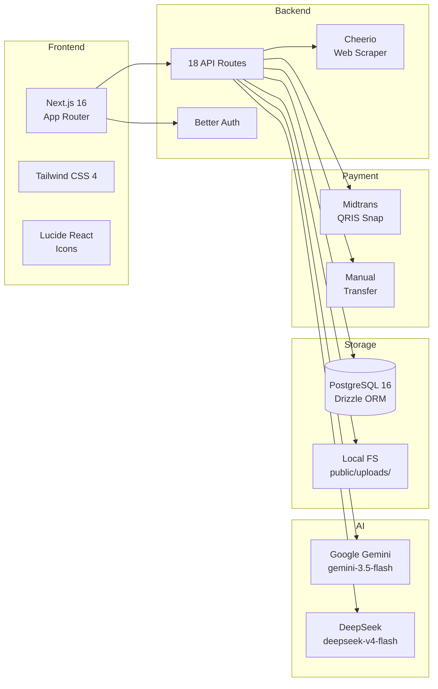
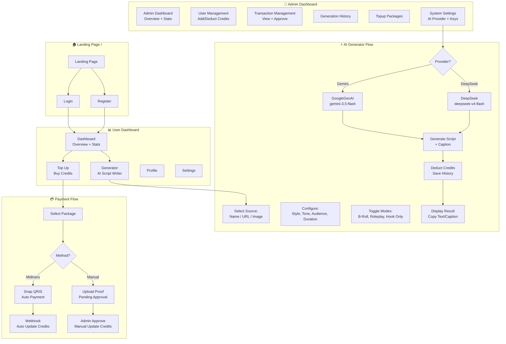
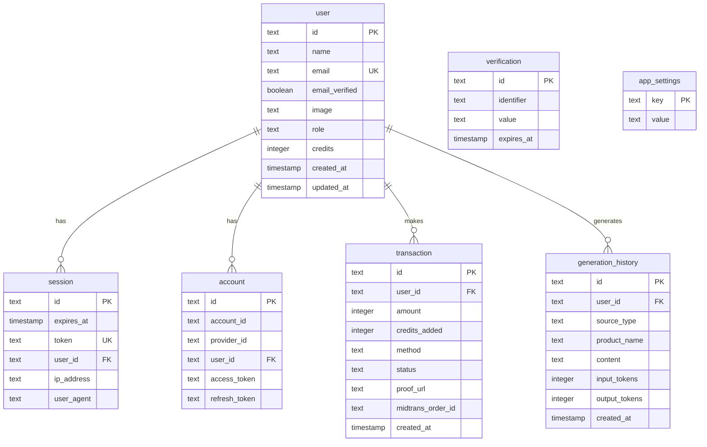

# 🚀 VO & Script Generator SaaS — Project Progress

**Last Updated:** 2026-06-19

---

## 📋 Executive Summary

Aplikasi generator naskah video TikTok/Reels berbasis AI dengan sistem kredit prabayar, scraping URL produk, dan sistem pembayaran (Midtrans QRIS + Manual Transfer).

| Metric | Value |
|--------|-------|
| **Status** | ✅ MVP Complete |
| **Framework** | Next.js 16 (App Router) |
| **Database** | PostgreSQL 16 + Drizzle ORM |
| **Auth** | Better Auth (Email/Password) |
| **AI Models** | Gemini (`gemini-3.5-flash`) + DeepSeek (`deepseek-v4-flash` / DeepSeek-V4 Flash) |
| **Total API Routes** | 18 |
| **Total Pages** | 14 |

---

## 🏗️ Tech Stack



---

## 🔄 Application Flowchart



---

## 📊 Database Schema



---

## ✅ Implementation Status: Phase by Phase

### Phase 1: Project Setup & Auth Foundation
| Task | Status | Notes |
|------|--------|-------|
| Next.js App Router + Tailwind + TypeScript | ✅ | Next.js 16.2.9 |
| Drizzle ORM + PostgreSQL | ✅ | PostgreSQL 16, 7 tables |
| Better Auth (Email/Password) | ✅ | Custom `role` + `credits` fields |
| Database Seed Script | ✅ | 2 accounts (user + admin) |
| Route Protection | ✅ | Per-route `auth.api.getSession()` |

### Phase 2: UI Slicing (Frontend)
| Task | Status | Notes |
|------|--------|-------|
| Dashboard Layout (Sidebar/Navbar) | ✅ | Responsive, dark mode |
| Generator UI | ✅ | Tabs, selects, toggles, result area |
| Pricing/Top-up UI | ✅ | Package selection page |
| Landing Page | ✅ | Hero, Features, Pricing sections |
| Auth Pages | ✅ | Login + Register |
| Admin Layout | ✅ | Sidebar + Navbar |
| Profile/Settings Pages | ✅ | User-facing settings |

### Phase 3: AI Engine & Scraping
| Task | Status | Notes |
|------|--------|-------|
| URL Scraping (Cheerio) | ✅ | `/api/scrape` + inline in generate |
| AI Generation API | ✅ | `/api/generate` with credit deduction |
| Gemini Integration | ✅ | 3-model retry (3.5-flash, 2.5-flash, 1.5-flash) |
| DeepSeek Integration | ✅ | `deepseek-chat` (DeepSeek-V3) via native fetch |
| Provider Switching | ✅ | Admin Settings: select Gemini or DeepSeek |
| Credit Deduction Logic | ✅ | 1/2/3 credits for name/url/image |
| History API | ✅ | CRUD generation history |
| Test API | ✅ | `/api/test-gemini` for testing |

### Phase 4: Payment & Admin
| Task | Status | Notes |
|------|--------|-------|
| Midtrans Snap Integration | ✅ | `/api/payment/create` |
| Midtrans Webhook | ✅ | `/api/webhooks/midtrans` with idempotency |
| Manual Payment Upload | ✅ | `/api/payment/manual` with file save |
| Admin Transaction List | ✅ | Full transaction view |
| Admin Approve Action | ✅ | `/api/admin/transactions/approve` |
| Admin User Management | ✅ | Add/deduct credits, change role |
| Admin Generation History | ✅ | View all generations |
| Admin Package Management | ✅ | CRUD topup packages |
| Admin System Settings | ✅ | AI provider, API keys, payment config |
| Admin Stats | ✅ | Dashboard overview stats |
| Notifications | ✅ | Payment status notifications |

---

## 🤖 AI Models Used

| Provider | Model ID | Type | Capabilities |
|----------|----------|------|-------------|
| **Google Gemini** | `gemini-3.5-flash` | Primary | Text + Image (multimodal) |
| **Google Gemini** | `gemini-2.5-flash` | Fallback | Text + Image |
| **Google Gemini** | `gemini-1.5-flash` | Fallback | Text + Image |
| **DeepSeek** | `deepseek-v4-flash` | Primary | Text only (DeepSeek-V4 Flash) |

> **Catatan:** `deepseek-v4-flash` adalah model terbaru DeepSeek (V4 Flash), lebih cepat dan efisien. Legacy `deepseek-chat` akan end-of-life 24 Juli 2026.

---

## 📂 Project Structure

```
VO-Script-Generator/
├── app/
│   ├── (auth)/login/       # Login page
│   ├── (auth)/register/    # Register page
│   ├── (dashboard)/
│   │   ├── dashboard/      # Overview + stats
│   │   ├── generator/      # AI script generator
│   │   ├── topup/          # Buy credits
│   │   ├── profile/        # User profile
│   │   └── settings/       # User settings
│   ├── (admin)/admin/
│   │   ├── page.tsx        # Admin dashboard
│   │   ├── users/          # User management
│   │   ├── transactions/   # Transaction management
│   │   ├── generations/    # Generation history
│   │   ├── packages/       # Package management
│   │   └── settings/       # System settings
│   ├── api/
│   │   ├── auth/[...all]/  # Better Auth handler
│   │   ├── generate/       # AI generation
│   │   ├── scrape/         # URL scraping
│   │   ├── history/        # Generation history
│   │   ├── payment/        # Midtrans + Manual
│   │   ├── webhooks/       # Midtrans callback
│   │   ├── admin/          # Admin APIs (7 routes)
│   │   ├── user/           # User APIs
│   │   └── test-gemini/    # API test endpoint
│   ├── page.tsx            # Landing page
│   └── layout.tsx          # Root layout
├── components/
│   ├── dashboard/          # Sidebar, Navbar, Nav
│   ├── admin/              # Admin Sidebar, Navbar, Table
│   ├── ui/                 # Shared UI (button, badge, etc.)
│   └── *.tsx               # Landing components
├── db/
│   ├── schema.ts           # Drizzle schema (7 tables)
│   ├── index.ts            # DB connection
│   └── seed.ts             # Seed script
├── lib/
│   ├── auth.ts             # Better Auth config
│   ├── auth-client.ts      # Client-side auth
│   └── midtrans.ts         # Midtrans SDK config
├── drizzle.config.ts       # Drizzle config
├── .env                    # Environment variables
├── PRD.md                  # Product Requirements
└── PROGRESS.md             # This file
```

---

## 🔑 Environment Variables

| Variable | Required | Description |
|----------|----------|-------------|
| `DATABASE_URL` | ✅ | PostgreSQL connection string |
| `BETTER_AUTH_SECRET` | ✅ | Auth encryption secret |
| `NEXT_PUBLIC_BETTER_AUTH_URL` | ✅ | Auth base URL |
| `GOOGLE_GEMINI_API_KEY` | ✅ | Gemini API key |
| `DEEPSEEK_API_KEY` | ✅ | DeepSeek API key |
| `MIDTRANS_SERVER_KEY` | ⬜ | Midtrans server key |
| `MIDTRANS_CLIENT_KEY` | ⬜ | Midtrans client key |
| `MIDTRANS_IS_PRODUCTION` | ⬜ | Sandbox/Production mode |

---

## 🚧 Known Issues / TODOs

1. **Middleware** — Route protection menggunakan per-route checks, bukan `middleware.ts` file. PRD sedianya menggunakan Next.js middleware.
2. **Supabase Storage** — PRD menyebut Supabase, implementasi menggunakan local filesystem (`public/uploads/`).
3. **Better Auth Session Types** — TypeScript errors pada custom fields (`credits`, `role`) belum resolve (pre-existing).
4. **DeepSeek Image Support** — DeepSeek V4 Flash tidak mendukung input gambar; hanya Gemini yang bisa terima gambar.
5. **Admin Account Security** — Admin settings page memiliki section password change yang belum terhubung ke backend.

---

## 🎯 Next Steps (Suggested)

1. ⬜ Fix Better Auth session TypeScript types untuk custom fields
2. ⬜ Tambahkan Supabase Storage untuk production (opsional)
3. ⬜ Implement middleware.ts untuk centralized route protection
4. ⬜ Tambahkan model DeepSeek terbaru jika sudah rilis (V4, Flash)
5. ⬜ Production deployment (Vercel + Supabase)
